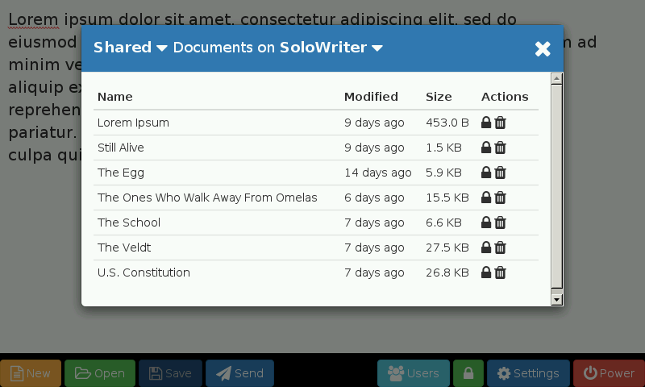
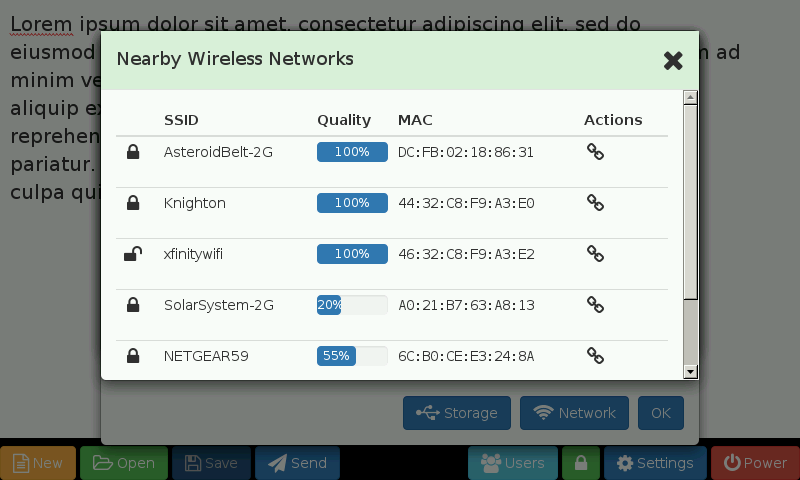

# Writing Free of Distractions
## Tapani Otala, September 2016

A personal project I recently completed reminded me of a movie quote by another engineer:

> Damage control is easy. Reading Klingon - that’s hard.
> - Chief Engineer Scotty in *[Star Trek IV: The Voyage Home](http://www.imdb.com/title/tt0092007/quotes?item=qt0444248)*

> Technology is easy. Designing a good user experience - that’s hard.
> - Me

Couple of months ago I read an article that mentioned a new product named [FreeWrite] for distraction-free writing. The product intrigued me because I have a college-bound son who could benefit from such a product. The only trouble was that the US$549 price tag seemed excessive considering its limited features. Granted, that is the whole point of the product, yet I felt confident that I could build something equivalent for far lower cost. I'm pleased to report that the finished product became a very nice parting gift to my son for his journey into creative writing, and only cost us about US$75. More on that later.

# Requirements

As with any product design task, first I sketched out some basic requirements to validate my design choices, prioritize the work and to ward off feature creep. I only had a month before my son left for college.

## Must Haves

* It must survive a college dorm or at least be cheap enough to not worry or easy enough to fix with commodity parts.
* It must be compact enough to easily transport to college and back, yet offer a display and keyboard bigger and better than a mobile phone.
* It must support choice of full-size ergonomic keyboard ([quaint](http://www.imdb.com/title/tt0092007/quotes?item=qt0444210) as they may be). Mouse should be [optional][minimalistic], especially if the device already has a touch screen.
* It must not offer any distractions:
	* No email, chat, messenger, SMS, etc.
 	* No way for a quick peek of YouTube, Facebook, Instagram, etc.
	* [KISS] and [YAGNI]: focus purely on the writing, not on fiddling with formatting like fonts, colors, line spacing, paragraph indents, and so on.
* It must be able to work completely offline for normal operation.
* It must be able to export the work to a USB flash drive or some other portable storage device.
* It must automatically save work periodically to avoid loss of data in case of power outage or accidents.

## Nice Haves

* It should be secured against unauthorized use (the evil maid - or roommate - attack).
* It should be able to run on battery power.
* It should support both wired and wireless networking.
* It should support tethering to a mobile phone hotspot.
* It should be able to send work over email service like Gmail.
* It should be able to save work to cloud services such as Google Drive, Dropbox, or Amazon Cloud Drive.
* It should offer at least some entertainment for a homesick college kid: music and/or photos, perhaps.
* It should offer some way to adjust text size
* It should be easy to update/extend, though requiring a visit to the “shop” can be handy excuse to have son visit home every now and then.
* It should log time spent actually writing, and provide a journal view.

# Features

Before diving into the technical details, let's take a look at the features the solution offers.

### User Accounts

You can create any number of user accounts.

### Private and Shared Documents

If you're logged in as a user, you can only see your own documents. Conversely, if you are not logged in as anyone, you can only see the shared documents. You can delete documents, or lock them against accidental overwrite or deletion.

### Settings

You can adjust text size and font, autosave frequency, lock screen, and so on.

### USB Storage Devices

The default storage for the documents is the internal storage of the device. However, you can plug in any USB storage device and select it as the storage. Shown here is a 16GB USB flash drive in the shape of a blue LEGO brick.

### Wired and Wireless Networking

You can see how (if at all) the device is connected to networks, including hotspots from mobile phones. This is showing a USB wireless adapter plugged in to a Raspberry Pi 2 device but not yet connected to any wireless network.

You can connect to any nearby wireless network, including mobile hotspots, provided you know the password. You can disconnect (or forget) previously connected wireless networks as well. While on this dialog, it scans the nearby wireless networks every 15 seconds.

### Send via Gmail

You can send the document via Gmail to anyone else. The sender must be on Gmail but the recipient can be anyone. The default sends the document to yourself.

### Slideshow

The device will start a slideshow after a configurable time, showing a random set of photos from any of the sets available. There are a couple of pre-defined sets of photos harvested from https://www.pexels.com. You can extend those sets or define your own by storing photos on a connected USB flash drive in a subfolder of a folder named *slides*.

# Choices, Choices, Choices

The trouble with having a lifetime of engineering experience is that I could think of so many different ways I could implement it. The problem is picking the best path forward. That's where those requirements come in handy.

The first design choice was the hardware platform: build it out of an existing device such as a tablet or laptop, or build it with a do-it-yourself platform like a Raspberry Pi. That decision turned out to be relatively easy, as even after adding few more essential parts, the cost of Raspberry Pi based device is pretty hard to beat. I was not particularly keen on trying out yet another cheap tablet, laptop or Chromebook given how many of them already litter our e-waste junk pile.

Having settled on a hardware platform, I initially thought I would just cobble together a software solution using any one of dozen other open-source text editors. This would certainly work fine for the actual task of writing. However, I quickly concluded that the operative word is *cobble*: starting out that way would result in an ill-fitting fragile system, typical of forced integrations of [dissimilar products](http://www.dezeen.com/2010/03/28/the-beginning-of-product-mutation-by-wannayos-boonperm-2/).

I also considered using a web browser in a kiosk mode (i.e full screen) and simply point it at Google Docs. Voilà! Unfortunately, a quick proof-of-concept with the oldest Raspberry Pi version 1B+ demonstrated that it did not quite have the muscle to run Google Docs. Besides, that solution would have suffered from the same integration nightmare as the earlier idea, further compounded by the dependency on almost-always-on network connection to the Google mothership.

While I rejected the idea of using Google Docs, it did yield one valuable insight: I could very easily build a single-page web application that runs on top of a web browser in kiosk mode, and offers a rich and flexible user experience that I can control completely. The only limitation was integrating with those system features that a browser-based web application normally cannot touch. That was easily solved by adding a lightweight web server running locally on the same platform to provide controlled access to the filesystem and other privileged system resources. That includes managing user accounts and authentication, handling USB storage devices and document files as well as configuring network interfaces.

# Implementing the Solution

This gets a bit technical so if you're not into tha kind of geekery, just TL;DR over this section.

## Software Components

As mentioned above, I chose to build the software as a single-page web application: a browser-based web UI with a lightweight web server running on the same device. That might seem like overly complicated solution, but I had several good reasons:

* It allowed me to prototype, develop and test the code fully on my much more powerful desktop PC before deploying it onto the Raspberry Pi.
* Even after deploying the code onto the Pi, I could continue to test the whole stack simply by pointing my desktop browser at the Pi’s address.
* It helped enforce a clear separation of concerns between the UI and the underlying data model, as well as keep the code highly portable. I was developing on a Windows PC while the Pi runs Linux.
* With minimal effort, it enabled the full rich user experience that is possible with modern day HTML/JS/CSS: layout, scalable fonts, colors, images, icons, and so on.
* I could easily take the same exact software stack and drop it onto a hosted cloud server like Amazon Web Services. That was definitely outside of the original requirements, but it seemed like a nice bonus benefit.

The major software components I used are all open source or free software projects:

* [Raspbian Jessie] OS: a bare-bones Linux distribution specifically for Raspberry Pi devices. I started from the Jessie Lite version and added more software as needed, rather than starting from the full version and having to strip out unnecessary features.
* [Matchbox]: a minimal X Windows window manager for embedded applications.
* [Midori]: a minimal web browser that offers a full-screen kiosk mode. I considered [KWeb] as well but ultimately settled on Midori.
* A lightweight web server built using the [Sinatra] framework written in [Ruby].
* A single-page web application built using [AngularJS], [Bootstrap], and [Font Awesome].

## Hardware Parts

The parts needed to build your own SoloWriter add up to about $150 excluding taxes & shipping. However, I only spent about $75 as the only new supplies I had to purchase were the 7” touch screen ($60) and the stand/case ($25) as I salvaged the rest from my junk pile of assorted computer parts.

I started with an older Raspberry Pi model 1B+ board my wife received as a freebie gift for interviewing at a tech company. That worked out well enough, though as the project progressed I decided to upgrade to a spare Raspberry Pi model 2 board for better performance. *And you thought I was only joking about that junk pile? Tsk tsk.* At any rate, the ideal board for this project would be the current generation Raspberry Pi model 3 with built-in WiFi and Bluetooth that saves on overall cost and leaves more USB ports free.

I chose a display case with LEGO compatible studs specifically because my son happens to be a long-time LEGO fan. It offers an outlet for creative pursuits not to mention a convenient parking spot for his LEGO-branded USB flash drive. There is also a version of that display case with a smooth front if you prefer a cleaner look.

The keyboard is mostly a matter of taste. Since this is intended solely for text editing, there’s not much point in buying a fancy gaming keyboard, or number keypads, and the like except for ergonomic preferences. A retro IBM PC clackety-clack keyboard could be cool except it might annoy the heck out of college dorm roommate. We used a compact knock-off of the Apple aluminum keyboard with built-in backlight for those last-minute all-nighters to finish an essay that's due tomorrow.

The prices here are a sampling from [MCM Electronics] and [Amazon.com]. Many of these parts are commodity items available from multiple vendors.

| Part                              | Cost                |
| --------------------------------- | ------------------: |
| Raspberry Pi single-board computer (any model; the newer the better) | [$35](http://www.mcmelectronics.com/product/83-17300) |
| Raspberry Pi 7” touch screen | [$60](http://www.mcmelectronics.com/product/83-16872) |
| SmartiPi Touch case for RPi and display (LEGO version) | [$25](http://www.mcmelectronics.com/product/83-17627) |
| Raspberry Pi Power Supply | [$6](http://www.mcmelectronics.com/product/28-19336) |
| MicroSD card (8GB or more) | [$5](http://www.mcmelectronics.com/product/83-17669) |
| USB keyboard | [$10](http://www.mcmelectronics.com/product/83-14186) |
| USB mouse (optional, since the display is a touchscreen) | [$5](http://www.mcmelectronics.com/product/83-14186) |
| USB WiFi adapter (optional, and only if using Raspberry Pi model 2 or older) | [$9](https://www.amazon.com/dp/B003MTTJOY/) |
| TOTAL | $155 |

# Future Enhancement Ideas

There are a lot of things that could be done to enhance this project further. Here are some of the ideas I may pursue in the future upgrade:

* I opted not to implement the ability to store documents directly in Google Drive, Dropbox, etc. just yet. Partially it was a matter of time, but mostly because I was not sure there would be network access to make it worthwhile.
* Work time journal: simple enough to implement, just did not have the time.
* Versioned document storage: ability to automatically save multiple versions of a document. Maybe use git or some other revision control system under the hood?
* Encrypted filesystem: while the password of each user account is stored securely using [PBKDF2](https://en.wikipedia.org/wiki/PBKDF2), the documents written by that user are not encrypted. That is, you can pull out the MicroSD card out of the Raspberry Pi and grab all the documents stored on it. I left it insecure for two reasons: 1) there was no easy way to extend that model to a removable USB flash drive in such a way that the user could open the documents on other devices like lab computers that may not have the necessary software, and 2) these aren't bank statements, they are college essays.
* System upgrade from a server or signed package on a USB flash drive. Again, simple enough, just a matter of time.

[minimalistic]: https://en.wikipedia.org/wiki/Minimalism_(computing)
[KISS]: https://en.wikipedia.org/wiki/KISS_principle
[YAGNI]: https://en.wikipedia.org/wiki/You_aren%27t_gonna_need_it

[Raspbian Jessie]: https://www.raspberrypi.org/downloads/raspbian/
[Matchbox]: https://www.yoctoproject.org/tools-resources/projects/matchbox
[Midori]: http://midori-browser.org/
[KWeb]: http://steinerdatenbank.de/software/kweb_manual.pdf
[Sinatra]: http://www.sinatrarb.com/
[Ruby]: https://www.ruby-lang.org/en/
[AngularJS]: https://angularjs.org/
[Bootstrap]: http://getbootstrap.com/
[Font Awesome]: http://fontawesome.io/

[FreeWrite]: https://getfreewrite.com/

[MCM Electronics]: http://www.mcmelectronics.com/
[Amazon.com]: https://www.amazon.com
